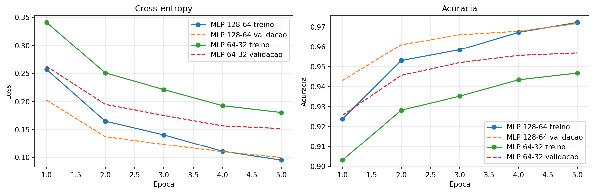
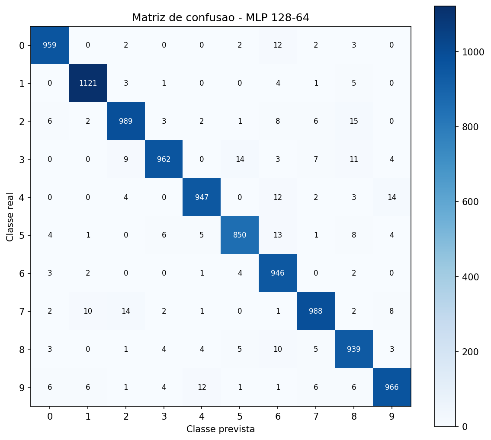

# MLP do Zero

Implementacao manual de um Multi-Layer Perceptron para classificar os digitos
do MNIST. Os calculos da rede, incluindo forward pass, backpropagation,
cross-entropy e SGD, foram implementados com NumPy.

O TensorFlow e usado somente para carregar o dataset MNIST.

## Como rodar

```bash
python -m venv .venv
source .venv/Scripts/activate
python -m pip install -r requirements.txt
python -m unittest discover -v
jupyter notebook notebooks/experimentos.ipynb
```

Para executar o notebook inteiro sem abrir o navegador:

```bash
python -m jupyter nbconvert --to notebook --execute --inplace notebooks/experimentos.ipynb --ExecutePreprocessor.timeout=1800
```

## Arquitetura escolhida

A configuracao principal foi:

```text
Entrada (784) -> ReLU (128) -> ReLU (64) -> Softmax (10)
```

- Os 784 valores de entrada correspondem aos pixels da imagem `28 x 28`.
- As duas camadas ocultas atendem ao requisito da atividade.
- ReLU foi usada por ser simples e ajudar a reduzir o problema de gradientes
  muito pequenos.
- A inicializacao He foi escolhida por combinar com a ReLU.
- A camada de saida possui 10 neuronios, um para cada digito, e usa softmax.
- A funcao de perda e cross-entropy.
- O treinamento usa mini-batches de 128 amostras e SGD.

A classe `MLP` aceita uma lista com qualquer quantidade de camadas, por exemplo
`MLP([784, 128, 64, 10])`.

## Resultados

As duas configuracoes foram treinadas durante 5 epocas.

| Configuracao | Arquitetura | Learning rate | Acuracia de validacao | Acuracia de teste | Loss de teste |
|---|---|---:|---:|---:|---:|
| MLP 128-64 | 784-128-64-10 | 0,10 | 97,16% | **96,67%** | 0,1086 |
| MLP 64-32 | 784-64-32-10 | 0,05 | 95,68% | **94,54%** | 0,1868 |

As duas configuracoes superaram a meta minima de 92%. A rede com 128 e 64
neuronios obteve o melhor resultado, mas exige mais operacoes e memoria.





A matriz mostra que a maior parte das previsoes esta na diagonal principal. As
confusoes mais frequentes foram `2 -> 8` (15 casos), `3 -> 5` (14 casos),
`4 -> 9` (14 casos) e `7 -> 2` (14 casos). Esses pares possuem formatos
visualmente parecidos em algumas escritas.

A tabela completa esta em [results/comparison.csv](results/comparison.csv), e
os exemplos classificados incorretamente estao em
[results/classification_errors.png](results/classification_errors.png).

## Decisoes e dificuldades

### Qual foi a decisao tecnica mais dificil que tomei?

A decisao tecnica mais dificil foi organizar o backpropagation para funcionar com um numero arbitrario de camadas. Eu armazenei as entradas, os resultados lineares e as ativacoes de cada camada durante o forward pass. Depois percorri as camadas na ordem inversa, aplicando a regra da cadeia. Para verificar se essa
implementacao estava correta.

### O que tentei que nao funcionou? O que aprendi?

Eu testei inicializar todos os pesos e vieses com zero em uma rede para resolver XOR. Mesmo depois de 1.500 epocas, a loss permaneceu em `0,6931`, a acuracia ficou em `50%` e a rede previu a classe `0` para todas as entradas.
Isso aconteceu porque todos os neuronios comecaram iguais, receberam gradientes iguais e continuaram aprendendo exatamente a mesma coisa. Aprendi que os pesos
precisam de uma inicializacao aleatoria que quebre essa simetria. Por isso usei a inicializacao He na versao final.

### Outras dificuldades encontradas

- Manter os formatos das matrizes corretos no forward e no backward. Um peso possui formato `(entradas, neuronios)`, enquanto o vies possui formato `(1, neuronios)` para funcionar com broadcasting.
- Implementar o backpropagation para uma quantidade arbitraria de camadas sem confundir os indices das ativacoes, pesos e gradientes.
- Evitar instabilidade numerica na softmax. Antes de calcular a exponencial, subtrai o maior valor de cada linha para impedir resultados infinitos.
- Descobrir se um erro estava no forward, no backward ou no otimizador.
- Avaliar todo o MNIST sem usar memoria desnecessaria.

### Se eu refizesse o projeto do zero, o que faria diferente?

Eu criaria os testes automatizados desde o inicio e faria o gradient check logo depois do primeiro backward pass. Isso permitiria encontrar erros nos gradientes antes de iniciar os experimentos mais demorados no MNIST. 

## Funcionamento

1. O forward pass calcula `Z = A_anterior @ W + b`.
2. A ReLU e aplicada nas camadas ocultas.
3. A softmax transforma a ultima saida em probabilidades.
4. A cross-entropy mede o erro das previsoes.
5. O backpropagation calcula os gradientes da ultima camada ate a primeira.
6. O SGD atualiza cada parametro usando `parametro -= learning_rate * gradiente`.

## Estrutura

```text
.
|-- mlp/
|   |-- activations.py
|   |-- losses.py
|   |-- network.py
|   `-- optimizers.py
|-- notebooks/
|   `-- experimentos.ipynb
|-- results/
|   |-- classification_errors.png
|   |-- comparison.csv
|   |-- confusion_matrix.png
|   `-- training_curves.png
|-- tests/
|   `-- test_mlp.py
|-- README.md
`-- requirements.txt
```
